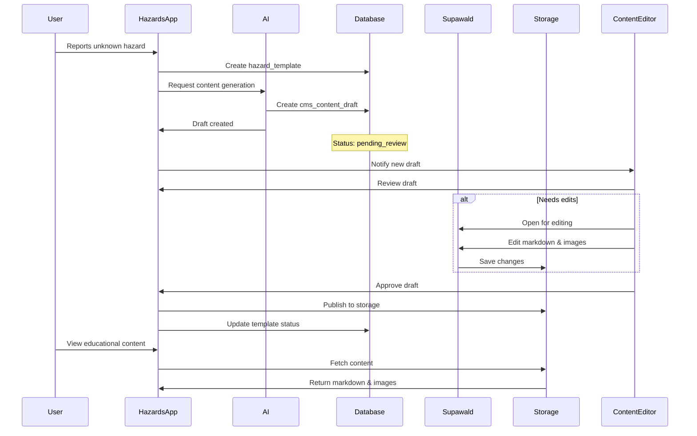
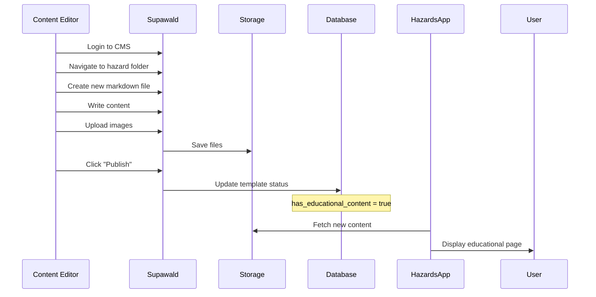

# Educational Content CMS Implementation Plan

**Date:** November 23, 2025  
**Status:** Planning Phase  
**Related Documents:**
- [Map Unification Plan](./MAP_UNIFICATION_PLAN.md)
- [Community Features Implementation](./COMMUNITY_FEATURES_IMPLEMENTATION_PLAN.md)

---

## Executive Summary

This document outlines the strategy for implementing educational content management using **Supawald CMS** as a sibling application to the main Hazards app. Educational content (hazard identification guides, treatment information, prevention tips) will be managed through a separate Next.js-based CMS and stored in Supabase Storage, with the main SvelteKit app fetching and displaying this content.

---

## Architecture Overview

### Two-Application System

```
┌─────────────────────────────────────────────────────────────┐
│                HAZARDS APPLICATION (SvelteKit)               │
│  Primary user-facing app for hazard reporting & viewing     │
│                                                              │
│  Routes:                                                     │
│  • /                       - Map view                        │
│  • /hazards/{id}          - Hazard detail                   │
│  • /learn/{category}      - Educational content             │
│  • /learn/{category}/{hazard} - Specific hazard guide       │
└─────────────────────────────────────────────────────────────┘
                              │
                              │ Reads content from
                              ▼
               ┌──────────────────────────────┐
               │   SUPABASE STORAGE BUCKET    │
               │ "hazard-educational-content" │
               │                              │
               │ Structure:                   │
               │ /plants/                     │
               │   /poisonous/                │
               │     /poison_ivy/             │
               │       - overview.md          │
               │       - identification.md    │
               │       - symptoms.md          │
               │       - treatment.md         │
               │       - prevention.md        │
               │       /images/               │
               │         - leaf-pattern.jpg   │
               │         - rash-example.jpg   │
               │ /insects/                    │
               │   /ticks/                    │
               │     /deer_tick/              │
               │       - overview.md          │
               │       - ...                  │
               └──────────────────────────────┘
                              │
                              │ Managed by
                              ▼
┌─────────────────────────────────────────────────────────────┐
│              SUPAWALD CMS (Next.js)                          │
│  Content management interface for editors & admins          │
│                                                              │
│  Access: https://cms.hazards-app.com                        │
│  Auth: Protected by basic auth (content editors only)       │
│                                                              │
│  Features:                                                   │
│  • Drag & drop file uploads                                 │
│  • In-place markdown editing                                │
│  • Folder navigation                                        │
│  • Real-time updates                                        │
│  • Publish API for triggering content refreshes             │
└─────────────────────────────────────────────────────────────┘
```

---

## Data Models

### Database Schema

#### 1. Hazard Templates (Educational Content References)

```sql
-- Updated hazard_templates table
CREATE TABLE hazard_templates (
  id UUID PRIMARY KEY DEFAULT gen_random_uuid(),
  category_id UUID NOT NULL REFERENCES hazard_categories(id),
  
  -- Basic Info
  name VARCHAR(200) NOT NULL,
  scientific_name VARCHAR(200),
  
  -- Storage Reference (managed by Supawald)
  storage_path VARCHAR(500) NOT NULL, -- e.g., "plants/poisonous/poison_ivy"
  
  -- Regional Variations
  regional_data JSONB DEFAULT '[]', -- Array of RegionalHazardData
  
  -- Content Status
  has_educational_content BOOLEAN DEFAULT false,
  needs_cms_content BOOLEAN DEFAULT false,
  is_user_generated BOOLEAN DEFAULT false,
  
  -- Publishing Metadata
  status VARCHAR(20) DEFAULT 'draft', -- draft, published, archived
  last_published_at TIMESTAMP WITH TIME ZONE,
  published_by UUID REFERENCES auth.users(id),
  
  -- Audit
  created_by UUID REFERENCES auth.users(id),
  created_at TIMESTAMP WITH TIME ZONE DEFAULT NOW(),
  updated_at TIMESTAMP WITH TIME ZONE DEFAULT NOW(),
  
  -- Indexes for performance
  CONSTRAINT unique_storage_path UNIQUE(storage_path)
);

CREATE INDEX idx_templates_storage_path ON hazard_templates(storage_path);
CREATE INDEX idx_templates_status ON hazard_templates(status);
CREATE INDEX idx_templates_needs_content ON hazard_templates(needs_cms_content) WHERE needs_cms_content = true;
```

#### 2. CMS Content Drafts (AI-Generated Content)

```sql
-- AI-generated content drafts awaiting human review
CREATE TABLE cms_content_drafts (
  id UUID PRIMARY KEY DEFAULT gen_random_uuid(),
  template_id UUID NOT NULL REFERENCES hazard_templates(id),
  
  -- Draft Content (before publishing to Storage)
  draft_files JSONB NOT NULL,
  /* Example structure:
  {
    "overview.md": "# Poison Ivy Overview\n\nPoison ivy is...",
    "identification.md": "# How to Identify Poison Ivy\n\n...",
    "symptoms.md": "...",
    "treatment.md": "...",
    "prevention.md": "...",
    "suggested_images": [
      {"url": "https://...", "description": "Leaf pattern", "source": "ai_generated"}
    ]
  }
  */
  
  -- AI Generation Metadata
  generation_method VARCHAR(50), -- 'ai_agent', 'user_submitted', 'scraped'
  ai_model VARCHAR(100), -- 'gpt-4', 'claude-3', etc.
  generation_prompt TEXT,
  confidence_score DECIMAL(3,2), -- 0.00 to 1.00
  
  -- Review Workflow
  status VARCHAR(20) DEFAULT 'pending_review',
  -- Statuses: pending_review, in_review, approved, rejected, published
  
  assigned_reviewer UUID REFERENCES auth.users(id),
  reviewed_by UUID REFERENCES auth.users(id),
  review_notes TEXT,
  reviewed_at TIMESTAMP WITH TIME ZONE,
  
  -- Publishing
  published_to_storage BOOLEAN DEFAULT false,
  published_at TIMESTAMP WITH TIME ZONE,
  
  -- Audit
  created_by VARCHAR(100) NOT NULL, -- 'ai_agent' or user_id
  created_at TIMESTAMP WITH TIME ZONE DEFAULT NOW(),
  updated_at TIMESTAMP WITH TIME ZONE DEFAULT NOW()
);

CREATE INDEX idx_drafts_status ON cms_content_drafts(status);
CREATE INDEX idx_drafts_template ON cms_content_drafts(template_id);
CREATE INDEX idx_drafts_needs_review ON cms_content_drafts(assigned_reviewer) WHERE status = 'pending_review';
```

#### 3. Content Edit History (Audit Log)

```sql
-- Track changes to educational content
CREATE TABLE content_edit_history (
  id UUID PRIMARY KEY DEFAULT gen_random_uuid(),
  template_id UUID NOT NULL REFERENCES hazard_templates(id),
  
  -- Change Details
  file_path VARCHAR(500) NOT NULL, -- Path within storage bucket
  change_type VARCHAR(20) NOT NULL, -- 'created', 'updated', 'deleted'
  
  -- Version Control
  previous_content TEXT,
  new_content TEXT,
  
  -- Editor Info
  edited_by UUID REFERENCES auth.users(id),
  editor_role VARCHAR(50), -- 'admin', 'content_editor', 'trusted_user', 'ai_agent'
  edit_notes TEXT,
  
  created_at TIMESTAMP WITH TIME ZONE DEFAULT NOW()
);

CREATE INDEX idx_edit_history_template ON content_edit_history(template_id);
CREATE INDEX idx_edit_history_date ON content_edit_history(created_at DESC);
```

---

## Supabase Storage Structure

### Bucket Configuration

```typescript
// Bucket: hazard-educational-content
// Access: Public reads, authenticated writes (content editors only)

export const STORAGE_CONFIG = {
  bucketName: 'hazard-educational-content',
  isPublic: true, // Allow public reads for educational content
  
  // Bucket Policies (RLS)
  policies: {
    // Anyone can read published content
    publicRead: true,
    
    // Only content editors, admins, and moderators can write
    allowedWriteRoles: ['admin', 'content_editor', 'moderator']
  },
  
  // File size limits
  maxFileSize: 10 * 1024 * 1024, // 10MB for images
  
  // Allowed file types
  allowedMimeTypes: [
    'text/markdown',
    'image/jpeg',
    'image/png',
    'image/webp',
    'application/pdf' // For detailed guides
  ]
};
```

### Directory Structure

```
hazard-educational-content/
│
├── plants/
│   ├── poisonous/
│   │   ├── poison_ivy/
│   │   │   ├── overview.md
│   │   │   ├── identification.md
│   │   │   ├── symptoms.md
│   │   │   ├── treatment.md
│   │   │   ├── prevention.md
│   │   │   ├── regional_notes.md
│   │   │   └── images/
│   │   │       ├── leaf-pattern-01.jpg
│   │   │       ├── leaf-pattern-02.jpg
│   │   │       ├── rash-example-01.jpg
│   │   │       └── habitat-example.jpg
│   │   │
│   │   ├── poison_oak/
│   │   │   └── ... (same structure)
│   │   │
│   │   └── poison_sumac/
│   │       └── ...
│   │
│   └── thorns/
│       ├── multiflora_rose/
│       │   └── ...
│       └── blackberry/
│           └── ...
│
├── insects/
│   ├── ticks/
│   │   ├── deer_tick/
│   │   │   ├── overview.md
│   │   │   ├── identification.md
│   │   │   ├── diseases.md          # Lyme disease info
│   │   │   ├── prevention.md
│   │   │   ├── removal.md           # How to safely remove
│   │   │   └── images/
│   │   │       └── ...
│   │   │
│   │   └── dog_tick/
│   │       └── ...
│   │
│   ├── stinging/
│   │   ├── yellow_jacket/
│   │   │   └── ...
│   │   │
│   │   └── bald_faced_hornet/
│   │       └── ...
│   │
│   └── mosquitos/
│       ├── overview.md
│       ├── regional_info.md          # Regional differences
│       └── images/
│           └── ...
│
├── terrain/
│   ├── unstable_ground/
│   │   ├── loose_rock/
│   │   └── mudslides/
│   │
│   └── water_hazards/
│       └── ...
│
└── animals/
    ├── bears/
    │   ├── black_bear/
    │   └── ...
    │
    └── snakes/
        ├── venomous/
        └── ...
```

### Markdown File Templates

#### overview.md
```markdown
# [Hazard Name]

## Quick Facts
- **Scientific Name:** [Latin name if applicable]
- **Danger Level:** [1-5 scale]
- **Active Season:** [Months or year-round]
- **Common Locations:** [Where typically found]
- **Affected Regions:** [Geographic areas]

## Description
[General description of the hazard, 2-3 paragraphs]

## Why It's Dangerous
[Explanation of the risks and potential harm]

## Related Resources
- [Link to identification guide]
- [Link to treatment information]
- [External resources]
```

#### identification.md
```markdown
# How to Identify [Hazard Name]

## Visual Identification

### Key Features
1. **[Feature 1]:** [Description]
2. **[Feature 2]:** [Description]
3. **[Feature 3]:** [Description]

### Common Look-alikes
- **[Similar hazard/object]:** How to tell them apart
- **[Similar hazard/object]:** Key differences

## Photos & Diagrams
[Images embedded with descriptions]

## Seasonal Variations
[How appearance changes throughout the year]

## Regional Differences
[How it varies by location]
```

---

## Implementation Phases

### Phase 1: Infrastructure Setup (Week 2, Days 1-3)

#### Tasks
1. **Set up Supabase Storage Bucket**
   - Create `hazard-educational-content` bucket
   - Configure public read access
   - Set up RLS policies for write access
   - Test file upload/download

2. **Deploy Supawald Instance**
   ```bash
   # In separate directory
   npx create-supawald hazards-cms
   cd hazards-cms
   
   # Configure .env.local
   NEXT_PUBLIC_SUPABASE_URL=your-project-url
   NEXT_PUBLIC_SUPABASE_ANON_KEY=your-anon-key
   NEXT_PUBLIC_BUCKET_NAME=hazard-educational-content
   AUTH_USERNAME=admin
   AUTH_PASSWORD=[secure-password]
   
   # Deploy to Vercel or similar
   npm run build
   ```

3. **Update Database Schema**
   - Apply migrations for new tables
   - Create indexes for performance
   - Set up RLS policies

4. **Create Initial Content Structure**
   - Set up folder hierarchy in Storage
   - Create template markdown files
   - Add placeholder images

**Deliverables:**
- ✅ Working Supawald CMS instance
- ✅ Configured Storage bucket
- ✅ Database schema updated
- ✅ Initial content structure in place

---

### Phase 2: Content Service Layer (Week 2, Days 4-5)

#### Tasks
1. **Create Educational Content Service**

```typescript
// src/lib/services/educational-content.service.ts

import { supabase } from '$lib/supabase';
import { marked } from 'marked'; // For markdown rendering

export interface EducationalContent {
  overview?: string;
  identification?: string;
  symptoms?: string;
  treatment?: string;
  prevention?: string;
  regionalNotes?: string;
  images: ContentImage[];
  lastUpdated: Date;
}

export interface ContentImage {
  url: string;
  name: string;
  description?: string;
  category: 'identification' | 'symptoms' | 'habitat' | 'treatment';
}

export class EducationalContentService {
  private bucketName = 'hazard-educational-content';
  private cache = new Map<string, { content: EducationalContent; expires: number }>();
  private cacheDuration = 1000 * 60 * 60; // 1 hour

  /**
   * Fetch all educational content for a hazard template
   */
  async getContent(storagePath: string): Promise<EducationalContent | null> {
    // Check cache first
    const cached = this.cache.get(storagePath);
    if (cached && cached.expires > Date.now()) {
      return cached.content;
    }

    try {
      const [overview, identification, symptoms, treatment, prevention, regionalNotes, images] =
        await Promise.all([
          this.fetchMarkdown(`${storagePath}/overview.md`),
          this.fetchMarkdown(`${storagePath}/identification.md`),
          this.fetchMarkdown(`${storagePath}/symptoms.md`),
          this.fetchMarkdown(`${storagePath}/treatment.md`),
          this.fetchMarkdown(`${storagePath}/prevention.md`),
          this.fetchMarkdown(`${storagePath}/regional_notes.md`),
          this.fetchImages(storagePath)
        ]);

      const content: EducationalContent = {
        overview,
        identification,
        symptoms,
        treatment,
        prevention,
        regionalNotes,
        images,
        lastUpdated: new Date()
      };

      // Cache the result
      this.cache.set(storagePath, {
        content,
        expires: Date.now() + this.cacheDuration
      });

      return content;
    } catch (error) {
      console.error('Error fetching educational content:', error);
      return null;
    }
  }

  /**
   * Fetch and parse a markdown file
   */
  private async fetchMarkdown(path: string): Promise<string | undefined> {
    const { data, error } = await supabase.storage.from(this.bucketName).download(path);

    if (error || !data) {
      return undefined;
    }

    const text = await data.text();
    return marked(text); // Convert markdown to HTML
  }

  /**
   * Fetch all images for a hazard
   */
  private async fetchImages(storagePath: string): Promise<ContentImage[]> {
    const { data: files, error } = await supabase.storage
      .from(this.bucketName)
      .list(`${storagePath}/images`);

    if (error || !files) {
      return [];
    }

    return files
      .filter((file) => file.name.match(/\.(jpg|jpeg|png|webp)$/i))
      .map((file) => {
        const { data: { publicUrl } } = supabase.storage
          .from(this.bucketName)
          .getPublicUrl(`${storagePath}/images/${file.name}`);

        return {
          url: publicUrl,
          name: file.name,
          category: this.inferImageCategory(file.name)
        };
      });
  }

  /**
   * Infer image category from filename
   */
  private inferImageCategory(filename: string): ContentImage['category'] {
    const lower = filename.toLowerCase();
    if (lower.includes('leaf') || lower.includes('identify')) return 'identification';
    if (lower.includes('rash') || lower.includes('symptom')) return 'symptoms';
    if (lower.includes('habitat') || lower.includes('location')) return 'habitat';
    if (lower.includes('treatment') || lower.includes('remedy')) return 'treatment';
    return 'identification';
  }

  /**
   * Check if content exists for a template
   */
  async contentExists(storagePath: string): Promise<boolean> {
    const { data, error } = await supabase.storage.from(this.bucketName).list(storagePath, {
      limit: 1
    });

    return !error && data !== null && data.length > 0;
  }

  /**
   * Invalidate cache for a specific path (called after content updates)
   */
  invalidateCache(storagePath: string): void {
    this.cache.delete(storagePath);
  }

  /**
   * Clear all cache
   */
  clearCache(): void {
    this.cache.clear();
  }
}

// Singleton instance
export const educationalContentService = new EducationalContentService();
```

2. **Create API Routes**

```typescript
// src/routes/api/content/[...path]/+server.ts
import { json } from '@sveltejs/kit';
import type { RequestHandler } from './$types';
import { educationalContentService } from '$lib/services/educational-content.service';

export const GET: RequestHandler = async ({ params }) => {
  const storagePath = params.path;

  const content = await educationalContentService.getContent(storagePath);

  if (!content) {
    return json({ error: 'Content not found' }, { status: 404 });
  }

  return json(content);
};
```

**Deliverables:**
- ✅ Educational content service implemented
- ✅ Caching layer in place
- ✅ API routes for content fetching
- ✅ Markdown rendering working

---

### Phase 3: AI Content Generation (Week 2, Days 6-7)

#### Tasks
1. **Create AI Content Generator Service**

```typescript
// src/lib/services/ai-content-generator.service.ts

import { supabase } from '$lib/supabase';
import type { HazardTemplate } from '$lib/types/database';

export interface HazardInfo {
  name: string;
  scientificName?: string;
  category: string;
  region: string;
  userDescription?: string;
}

export interface GeneratedContent {
  overview: string;
  identification: string;
  symptoms: string;
  treatment: string;
  prevention: string;
  confidence: number;
  sources: string[];
}

export class AIContentGenerator {
  /**
   * Generate educational content draft for a new hazard
   */
  async generateDraft(
    templateId: string,
    hazardInfo: HazardInfo
  ): Promise<{ draftId: string; content: GeneratedContent }> {
    // 1. Generate content using AI (placeholder for now)
    const content = await this.callAIService(hazardInfo);

    // 2. Save as draft in database
    const { data: draft, error } = await supabase
      .from('cms_content_drafts')
      .insert({
        template_id: templateId,
        draft_files: {
          'overview.md': content.overview,
          'identification.md': content.identification,
          'symptoms.md': content.symptoms,
          'treatment.md': content.treatment,
          'prevention.md': content.prevention
        },
        generation_method: 'ai_agent',
        ai_model: 'gpt-4', // Or whichever model is used
        confidence_score: content.confidence,
        status: 'pending_review',
        created_by: 'ai_agent'
      })
      .select()
      .single();

    if (error) {
      throw new Error(`Failed to create draft: ${error.message}`);
    }

    // 3. Notify content editors (optional)
    await this.notifyContentEditors(draft.id, hazardInfo.name);

    return {
      draftId: draft.id,
      content
    };
  }

  /**
   * Call AI service to generate content sections
   */
  private async callAIService(info: HazardInfo): Promise<GeneratedContent> {
    // TODO: Integrate with AI service (OpenAI, Anthropic, etc.)
    // For now, return placeholder content

    const prompt = this.buildPrompt(info);

    // Simulated AI response
    return {
      overview: `# ${info.name}\n\n${info.name} is a common hazard found in ${info.region}...`,
      identification: `# How to Identify ${info.name}\n\nKey features to look for...`,
      symptoms: `# Symptoms of ${info.name} Exposure\n\nCommon symptoms include...`,
      treatment: `# Treatment for ${info.name}\n\nIf exposed, take these steps...`,
      prevention: `# Preventing ${info.name} Exposure\n\nTo avoid this hazard...`,
      confidence: 0.85,
      sources: [
        'CDC Guidelines',
        'National Park Service',
        'Medical Literature'
      ]
    };
  }

  /**
   * Build AI prompt for content generation
   */
  private buildPrompt(info: HazardInfo): string {
    return `
Generate comprehensive educational content about the following hazard:

Hazard Name: ${info.name}
Scientific Name: ${info.scientificName || 'Unknown'}
Category: ${info.category}
Region: ${info.region}
User Description: ${info.userDescription || 'No additional description'}

Please create content for the following sections:
1. Overview (2-3 paragraphs with quick facts)
2. Identification (detailed visual description with key features)
3. Symptoms (if applicable - what happens if exposed/encountered)
4. Treatment (immediate and long-term response)
5. Prevention (how to avoid this hazard)

Format each section in Markdown. Be factual, concise, and prioritize safety.
    `.trim();
  }

  /**
   * Notify content editors about new draft
   */
  private async notifyContentEditors(draftId: string, hazardName: string): Promise<void> {
    // TODO: Implement notification system
    // Could use Supabase Realtime, email, or in-app notifications
    console.log(`New draft created for ${hazardName}: ${draftId}`);
  }

  /**
   * Get all pending drafts for review
   */
  async getPendingDrafts() {
    const { data, error } = await supabase
      .from('cms_content_drafts')
      .select(`
        *,
        hazard_templates (
          name,
          category:hazard_categories (
            name,
            path
          )
        )
      `)
      .eq('status', 'pending_review')
      .order('created_at', { ascending: false });

    if (error) {
      throw new Error(`Failed to fetch drafts: ${error.message}`);
    }

    return data;
  }

  /**
   * Approve and publish a draft to Supabase Storage
   */
  async approveDraft(draftId: string, reviewerId: string): Promise<void> {
    // 1. Get the draft
    const { data: draft, error: fetchError } = await supabase
      .from('cms_content_drafts')
      .select('*, hazard_templates(storage_path)')
      .eq('id', draftId)
      .single();

    if (fetchError) {
      throw new Error(`Failed to fetch draft: ${fetchError.message}`);
    }

    // 2. Upload files to Storage
    const storagePath = draft.hazard_templates.storage_path;
    const files = draft.draft_files;

    for (const [filename, content] of Object.entries(files)) {
      const { error: uploadError } = await supabase.storage
        .from('hazard-educational-content')
        .upload(`${storagePath}/${filename}`, content, {
          contentType: 'text/markdown',
          upsert: true
        });

      if (uploadError) {
        throw new Error(`Failed to upload ${filename}: ${uploadError.message}`);
      }
    }

    // 3. Update draft status
    await supabase
      .from('cms_content_drafts')
      .update({
        status: 'published',
        reviewed_by: reviewerId,
        reviewed_at: new Date().toISOString(),
        published_to_storage: true,
        published_at: new Date().toISOString()
      })
      .eq('id', draftId);

    // 4. Update template status
    await supabase
      .from('hazard_templates')
      .update({
        has_educational_content: true,
        needs_cms_content: false,
        last_published_at: new Date().toISOString(),
        published_by: reviewerId
      })
      .eq('id', draft.template_id);

    // 5. Invalidate content cache
    const contentService = await import('./educational-content.service');
    contentService.educationalContentService.invalidateCache(storagePath);
  }
}

// Singleton instance
export const aiContentGenerator = new AIContentGenerator();
```

**Deliverables:**
- ✅ AI content generation service
- ✅ Draft creation workflow
- ✅ Content review system
- ✅ Publishing to Storage

---

### Phase 4: Frontend Integration (Week 8)

#### Tasks
1. **Create Educational Content Pages**

```svelte
<!-- src/routes/learn/[category]/[hazard]/+page.svelte -->
<script lang="ts">
  import { page } from '$app/stores';
  import type { EducationalContent } from '$lib/services/educational-content.service';
  import ImageGallery from '$lib/components/ImageGallery.svelte';
  import ContentSection from '$lib/components/ContentSection.svelte';
  
  export let data: { content: EducationalContent };
  
  const tabs = [
    { id: 'overview', label: 'Overview', icon: '📋' },
    { id: 'identification', label: 'Identification', icon: '🔍' },
    { id: 'symptoms', label: 'Symptoms', icon: '🩹' },
    { id: 'treatment', label: 'Treatment', icon: '💊' },
    { id: 'prevention', label: 'Prevention', icon: '🛡️' }
  ];
  
  let activeTab = 'overview';
</script>

<div class="educational-content">
  <nav class="content-tabs">
    {#each tabs as tab}
      <button
        class:active={activeTab === tab.id}
        on:click={() => activeTab = tab.id}
      >
        <span class="icon">{tab.icon}</span>
        <span>{tab.label}</span>
      </button>
    {/each}
  </nav>
  
  <article class="content-body">
    {#if activeTab === 'overview' && data.content.overview}
      <ContentSection html={data.content.overview} />
    {:else if activeTab === 'identification' && data.content.identification}
      <ContentSection html={data.content.identification} />
      <ImageGallery 
        images={data.content.images.filter(img => img.category === 'identification')}
        title="Identification Photos"
      />
    {:else if activeTab === 'symptoms' && data.content.symptoms}
      <ContentSection html={data.content.symptoms} />
    {:else if activeTab === 'treatment' && data.content.treatment}
      <ContentSection html={data.content.treatment} />
    {:else if activeTab === 'prevention' && data.content.prevention}
      <ContentSection html={data.content.prevention} />
    {/if}
  </article>
  
  <aside class="content-sidebar">
    <h3>Related Hazards</h3>
    <!-- List related hazards -->
    
    <h3>Report a Sighting</h3>
    <a href="/hazards/create" class="btn-report">
      Report This Hazard
    </a>
  </aside>
</div>

<style>
  .educational-content {
    display: grid;
    grid-template-columns: 1fr 300px;
    gap: 2rem;
    max-width: 1200px;
    margin: 0 auto;
    padding: 2rem;
  }
  
  .content-tabs {
    grid-column: 1 / -1;
    display: flex;
    gap: 0.5rem;
    border-bottom: 2px solid var(--border-color);
  }
  
  .content-tabs button {
    padding: 0.75rem 1.5rem;
    border: none;
    background: none;
    cursor: pointer;
    display: flex;
    align-items: center;
    gap: 0.5rem;
    color: var(--text-secondary);
    transition: all 0.2s;
  }
  
  .content-tabs button.active {
    color: var(--primary-color);
    border-bottom: 3px solid var(--primary-color);
    margin-bottom: -2px;
  }
  
  .content-body {
    min-height: 400px;
  }
  
  @media (max-width: 768px) {
    .educational-content {
      grid-template-columns: 1fr;
    }
  }
</style>
```

2. **Create Content Editor Dashboard**

```svelte
<!-- src/routes/admin/content-drafts/+page.svelte -->
<script lang="ts">
  import { aiContentGenerator } from '$lib/services/ai-content-generator.service';
  import DraftCard from '$lib/components/admin/DraftCard.svelte';
  
  export let data: { drafts: any[] };
  
  async function approveDraft(draftId: string) {
    try {
      await aiContentGenerator.approveDraft(draftId, data.user.id);
      // Refresh drafts list
    } catch (error) {
      console.error('Failed to approve draft:', error);
    }
  }
</script>

<div class="dashboard">
  <h1>Pending Content Drafts</h1>
  
  <div class="drafts-grid">
    {#each data.drafts as draft}
      <DraftCard
        {draft}
        on:approve={() => approveDraft(draft.id)}
        on:reject={() => {/* Handle rejection */}}
        on:edit={() => {/* Open in Supawald */}}
      />
    {/each}
  </div>
</div>
```

**Deliverables:**
- ✅ Educational content pages
- ✅ Content editor dashboard
- ✅ Draft review interface
- ✅ Navigation and linking

---

## Content Editor Workflows

### Workflow 1: AI-Generated Draft → Review → Publish



### Workflow 2: Manual Content Creation via Supawald



---

## Regional Content Strategy

### Broad Regions (MVP)

```typescript
export const REGIONS = {
  US_NORTHEAST: {
    code: 'us_northeast',
    name: 'US Northeast',
    states: ['ME', 'NH', 'VT', 'MA', 'RI', 'CT', 'NY', 'PA', 'NJ'],
    timezone: 'America/New_York',
    commonHazards: [
      'poison_ivy',
      'deer_tick',
      'black_bear',
      'copperhead_snake'
    ]
  },
  US_SOUTHEAST: {
    code: 'us_southeast',
    name: 'US Southeast',
    states: ['MD', 'DE', 'VA', 'WV', 'KY', 'TN', 'NC', 'SC', 'GA', 'FL', 'AL', 'MS', 'LA', 'AR'],
    timezone: 'America/New_York',
    commonHazards: [
      'poison_ivy',
      'fire_ants',
      'alligators',
      'cottonmouth_snake',
      'hurricane_debris'
    ]
  },
  US_MIDWEST: {
    code: 'us_midwest',
    name: 'US Midwest',
    states: ['OH', 'MI', 'IN', 'IL', 'WI', 'MN', 'IA', 'MO', 'ND', 'SD', 'NE', 'KS'],
    timezone: 'America/Chicago',
    commonHazards: [
      'poison_ivy',
      'deer_tick',
      'wood_tick',
      'tornado_debris'
    ]
  },
  US_SOUTHWEST: {
    code: 'us_southwest',
    name: 'US Southwest',
    states: ['TX', 'OK', 'NM', 'AZ'],
    timezone: 'America/Denver',
    commonHazards: [
      'rattlesnake',
      'scorpion',
      'cactus',
      'black_widow',
      'heat_exhaustion'
    ]
  },
  US_WEST: {
    code: 'us_west',
    name: 'US West',
    states: ['MT', 'ID', 'WY', 'CO', 'UT', 'NV', 'CA', 'OR', 'WA'],
    timezone: 'America/Los_Angeles',
    commonHazards: [
      'poison_oak',
      'mountain_lion',
      'grizzly_bear',
      'rattlesnake',
      'wildfire_smoke'
    ]
  }
};
```

### Regional Variation Example

```markdown
<!-- In regional_notes.md for poison_ivy -->

# Regional Differences for Poison Ivy

## US Northeast
- **Active Season:** April - October
- **Peak Danger:** June - August
- **Common Locations:** Forest edges, hiking trails, old stone walls
- **Notes:** Often grows as ground cover or climbing vine. Especially prevalent after wet springs.

## US Southeast
- **Active Season:** March - November (longer season)
- **Peak Danger:** May - September
- **Common Locations:** Wooded areas, stream banks, fence lines
- **Notes:** More aggressive growth in humid conditions. Can grow larger and thicker.

## US Midwest
- **Active Season:** May - September
- **Peak Danger:** June - August
- **Common Locations:** Forest edges, abandoned fields, lakeshores
- **Notes:** Often mixed with other vegetation. Watch for it near recreational areas.

## US West
- **Active Season:** Variable (similar species: Poison Oak more common)
- **Peak Danger:** June - August
- **Notes:** Poison ivy less common; Poison Oak is the primary concern in this region.
```

---

## Content Quality Guidelines

### Content Requirements

1. **Accuracy**
   - All medical/safety information must be fact-checked
   - Include sources and references
   - Review by subject matter experts when possible

2. **Clarity**
   - Write at 8th-grade reading level
   - Use simple language for safety-critical information
   - Include visual aids where helpful

3. **Completeness**
   - All sections must be filled out
   - Regional variations documented
   - Related hazards cross-referenced

4. **Images**
   - High-quality, clear photos
   - Multiple angles/stages when relevant
   - Proper attribution and licensing

### Content Review Checklist

- [ ] **Overview section complete** with quick facts
- [ ] **Identification section** has clear visual descriptions
- [ ] **Symptoms section** describes exposure effects
- [ ] **Treatment section** provides actionable steps
- [ ] **Prevention section** explains avoidance strategies
- [ ] **Regional notes** documented for applicable regions
- [ ] **Images uploaded** for identification
- [ ] **Cross-references** to related hazards added
- [ ] **Sources cited** for medical/scientific claims
- [ ] **Markdown formatting** correct and consistent
- [ ] **No spelling/grammar errors**
- [ ] **Mobile-friendly** layout tested

---

## Initial Content Priorities (Boston Area)

### Priority 1 (Week 2)
1. **Poison Ivy** - Most common hazard
2. **Deer Ticks** - Lyme disease concern
3. **Yellow Jackets** - Frequent encounters

### Priority 2 (Week 3-4)
4. **Eastern Copperhead** - Venomous snake
5. **Multiflora Rose** - Thorns hazard
6. **Loose Rock** - Trail hazard

### Priority 3 (Week 5-6)
7. **Black Bears** - Wildlife safety
8. **Mosquitos** - Disease vectors
9. **Water Hazards** - Drowning risks
10. **Heat Exhaustion** - Summer hazard

---

## Success Metrics

### Content Coverage
- [ ] 80% of reported hazard types have educational content
- [ ] All Boston-area hazards documented
- [ ] Regional variations documented for seasonal hazards

### Content Quality
- [ ] 90% of content reviewed by subject matter experts
- [ ] All images properly attributed
- [ ] Zero reported inaccuracies in medical/safety information

### User Engagement
- [ ] Educational pages viewed 10,000+ times/month
- [ ] 70% of hazard detail views click through to educational content
- [ ] Average time on educational pages: 3+ minutes

### Content Velocity
- [ ] AI-generated drafts created within 5 minutes
- [ ] Human review completed within 48 hours
- [ ] Content published to app within 1 hour of approval

---

## Risk Mitigation

### Risk: Inaccurate Medical/Safety Information
**Impact:** High - Could lead to injury  
**Mitigation:**
- Require expert review for medical content
- Include disclaimers
- Cite authoritative sources
- Regular content audits

### Risk: AI-Generated Content Quality
**Impact:** Medium - Poor user experience  
**Mitigation:**
- Always require human review
- Set confidence thresholds
- Allow manual editing
- A/B test AI vs human-written content

### Risk: Content Maintenance Burden
**Impact:** Medium - Outdated information  
**Mitigation:**
- Set review cycles (annual review)
- Version control in Storage
- Track last updated dates
- Community reporting of errors

### Risk: Supawald Dependency
**Impact:** Low - CMS unavailable  
**Mitigation:**
- Content stored in Supabase (not Supawald-specific)
- Can switch to alternative CMS
- Direct Storage API access available
- Export/backup procedures

---

## Future Enhancements

### Phase 2 Features (Post-MVP)
1. **Multi-language Support**
   - Spanish, French translations
   - Locale-specific content

2. **Video Content**
   - Identification tutorials
   - Treatment demonstrations

3. **Interactive Quizzes**
   - Test identification skills
   - Safety knowledge checks

4. **User Contributions**
   - Community-submitted content
   - Expert verification process

5. **Advanced Regional Data**
   - Climate zone integration
   - Micro-regional variations
   - Real-time seasonal updates

6. **Content Analytics**
   - Track most-viewed sections
   - Identify content gaps
   - Measure educational impact

---

## Appendix

### A. File Naming Conventions

```
# Markdown files
overview.md
identification.md
symptoms.md
treatment.md
prevention.md
regional_notes.md

# Image files
{hazard-name}-{category}-{number}.{ext}
Examples:
  poison-ivy-leaf-pattern-01.jpg
  deer-tick-identification-02.png
  yellow-jacket-nest-habitat-01.jpg
```

### B. Markdown Style Guide

```markdown
# Main Heading (H1) - One per file

## Section Heading (H2)

### Subsection (H3)

**Bold** for emphasis
*Italic* for terms
`code` for technical terms

- Unordered list
- Item 2

1. Ordered list
2. Step 2

> Important note or warning

[Link text](url)


```

### C. AI Prompt Templates

See separate document: `AI_CONTENT_GENERATION_PROMPTS.md`

### D. Supawald Configuration

See separate document: `SUPAWALD_DEPLOYMENT_GUIDE.md`

---

## Document History

| Version | Date | Author | Changes |
|---------|------|--------|---------|
| 1.0 | 2025-11-23 | System | Initial planning document |

---

**Next Steps:**
1. Review and approve this plan
2. Set up Supabase Storage bucket
3. Deploy Supawald instance
4. Begin Phase 1 implementation
